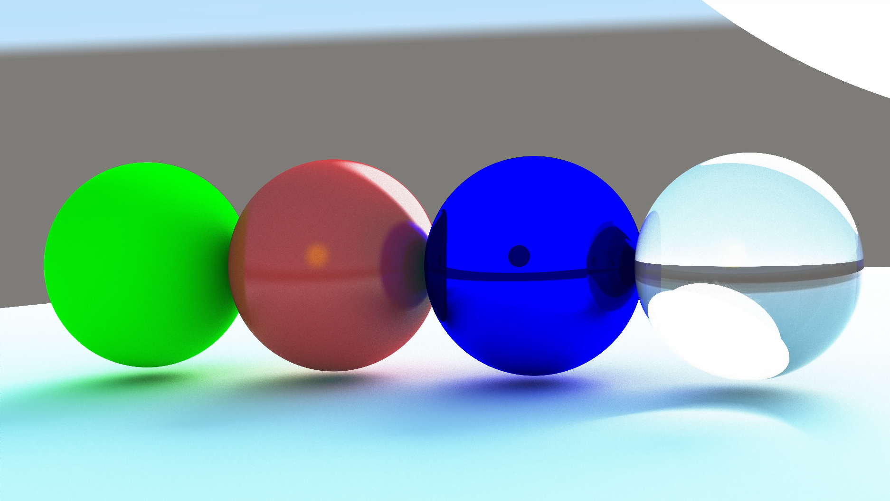
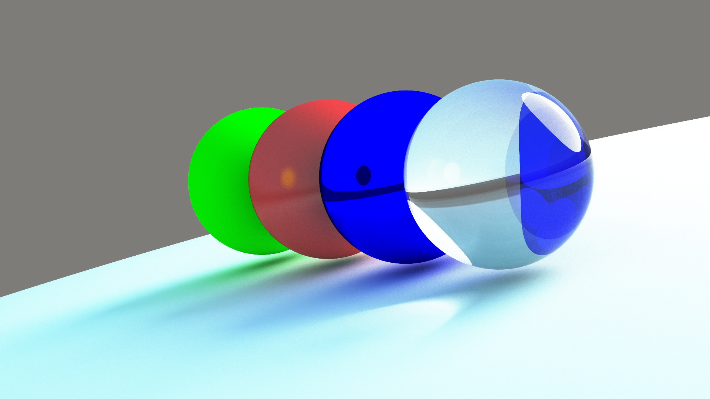
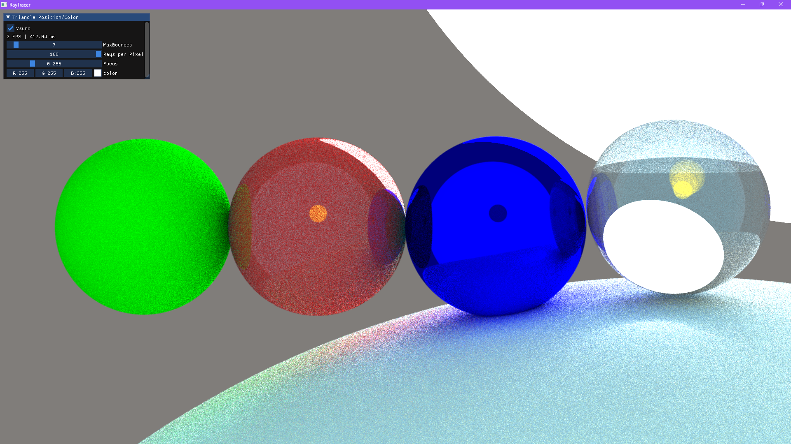
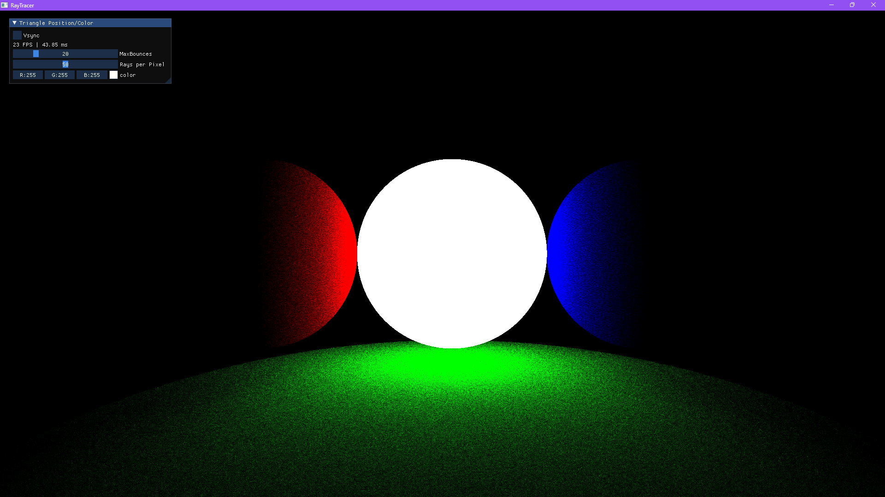

# Raytracing Project Documentation

Welcome to the documentation for the Raytracing project. This repository contains the following documentation files:

-   [Camera Class Documentation](./docs/Camera.md)
-   [Maths Class Documentation](./docs/Maths.md)
-   [Input Class Documentation](./docs/Input.md)
-   [Shader Class Documentation](./docs/Shader.md)
-   [GLSL Shader Documentation](./docs/GLSLShader.md)

Please click on the links above to access the documentation for each component.

## Folder Structure

-   `docs/`: Contains the documentation files for each component.
-   `src/`: Contains the source code for the Raytracing project.
-   `shaders/`: Contains the shader source code
-   `lib/`: Should contain the required libraries.

## Project Showcase

Here are some images showcasing the Raytracing project:







## Getting Started

To get started with the Raytracing project, please follow these steps:

1. Clone the repository to your local machine.
2. Ensure that the required libraries are present in the 'lib/' folder.
3. Refer to the documentation for each component to understand their usage and functionality.

## Running

To compile and run the Raytracing application, use the following commands:

1. Compile the application using 'make':

    ```
    make
    ```

2. Run the application:
    ```
    make run
    ```

Make sure you have the necessary dependencies and build tools installed on your system to successfully compile and run the application.

## Contributing

Contributions to the Raytracing project are welcome! If you find any issues or would like to add new features, please feel free to open an issue or submit a pull request.

## License

The Raytracing project is licensed under the [MIT License](LICENSE).
